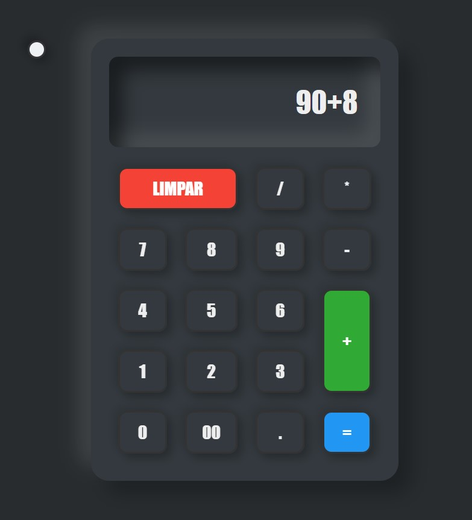

<h1 align="center">Calculadora ➕➖✖️➗</h1>

<h2 align="center">Meu 3º projeto em Desenvolvimento Front-End ​​💻​​</h2> 

 

<h2 align="center">Sobre 📑</h2>

Uma calculadora com funções essenciais para aprimorar meus conhecimentos em CSS e JavaScript. Ela conta ainda com a opção de mudar de tema (botão branco no canto esquerdo superior), aplicando um background de acordo com o que o usuário preferir.
 

<h2 align="center">Tecnologias ​⌨️​</h2>

HTML e CSS - JavaScript - Git e GitHub
 

<h2 align="center">Para acessar ​🔗️</h2>

<a href="https://​nbra98.github.io/calculadora/">Clique aqui</a>
  

